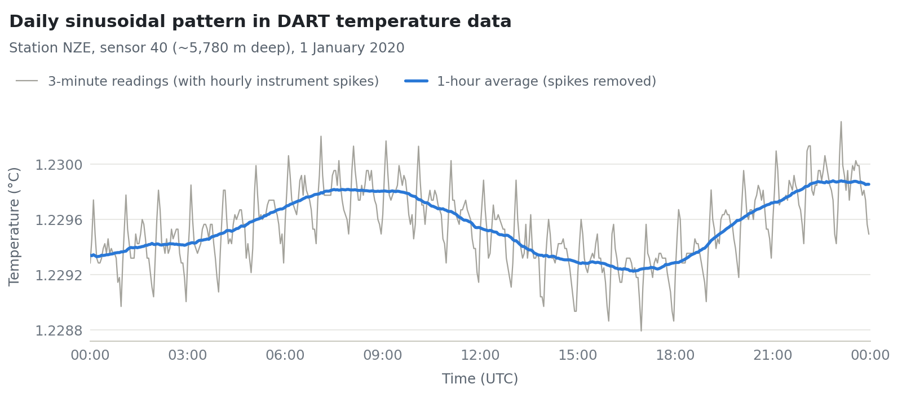

# Repurposing the DART Network to Expand Deep-Ocean Data Availability

This undergraduate research project asks whether New Zealand's tsunami early-warning sensors can double as deep-ocean thermometers.

**Stack:** Python · pandas · matplotlib · argopy · REST API (GeoNet) · Jupyter

📄 **Full report:** [`research_report.pdf`](research_report.pdf)

## Purpose

Deep-ocean data is scarce due to the vastness of the ocean and the high cost of implementing new instruments. This project aims to improve deep-ocean data visibility through **repurposing existing infrastructure**.

GeoNet's **DART** tsunami-warning network has 12 bottom pressure recorders on the sea floor around New Zealand. Each contains a sensor that monitors the temperature of its internal components. This project investigates whether this data can be repurposed as a measurement of the surrounding deep-water temperature, which would create new historical datasets for fixed-location deep-ocean temperatures at no cost.

## Discovery

Each day's temperature shows a clear **sinusoidal pattern** mixed with hourly spikes. These spikes are consistent in strength and timing, and are likely a result of some functionality of the instrument. The sinusoidal pattern is present each day, but with varying strength. The sinusoidal shape leads me to believe this is a natural pattern caused by the Earth's rotation and the gravitational pull of the Moon and Sun, similar to tidal forcing. This sinusoidal pattern is the most promising area for future study.

<picture>
  <source media="(prefers-color-scheme: dark)" srcset="figures/daily_cycle_dark.png">
  
</picture>

Questions for further study:

- Does the pattern's strength vary over a yearly cycle with the **Sun's** gravitational pull, peaking in early January when Earth is closest to the Sun?
- Does the pattern's strength change over a monthly cycle with the **Moon's** gravitational pull, is there is peak during full and new moons?
- How does the pattern's strength compare between sensors and stations, and does it vary by **location**?

## Limitations

- **Wrong absolute values:** Each sensor has a different base temperature measurement, including sensors at the same station location.
- **Event mode:** Pressure spikes cause the sampling rate to increase, resulting in greater heat for a fixed period.
- **Sub-hourly data:** Data below a hourly resolution are noisy due to some routine operation from the instrument.
- **Data availability:** Temperature data is stored locally on the sensor and is only available after maintenance, which is about every two years.

## Approach

- Wrote a small client for the GeoNet API that pulls temperature, pressure and water-height records for all 12 stations and their sensors.
- Detected and isolated periods when the device switched to rapid "event mode" sampling, and measured their effect on the temperature.
- Checked reliability against Deep Argo floats, a trusted independent source, using `argopy`.
- Compared sensors within and across stations, and searched for natural patterns at daily, monthly and yearly timescales.

## Acknowledgements

Supervised by Melissa Bowen. DART data from [GeoNet / GNS Science](https://doi.org/10.21420/8TCZ-TV02); Argo data from the [International Argo Program](https://doi.org/10.17882/42182).
